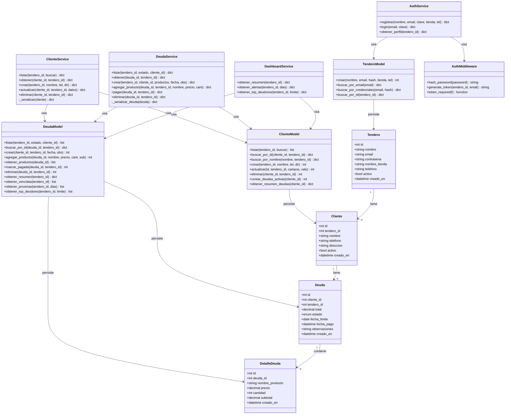

# Diagrama de Clases
## Evidencia GA8-220501096-AA1-EV01 — SENA
**Autor:** Carlos Varón | **Proyecto:** Cuenta Clara

---

## Descripción

El diagrama de clases muestra las entidades del sistema, sus atributos, métodos y las relaciones entre ellas. Cuenta Clara sigue el **patrón Repository** con tres capas:

- **Models** → acceso a datos (repositorios)
- **Services** → lógica de negocio
- **Routes** → controladores HTTP

---

## Diagrama

---

## Relaciones principales

| Relación | Tipo | Descripción |
|---|---|---|
| Tendero → Cliente | 1 a N | Un tendero tiene muchos clientes |
| Cliente → Deuda | 1 a N | Un cliente puede tener muchas deudas |
| Deuda → DetalleDeuda | 1 a N | Una deuda tiene muchos productos |
| Service → Model | Dependencia | Los servicios usan los modelos para acceder a datos |
| AuthService → Middleware | Dependencia | Usa hash y JWT para seguridad |
